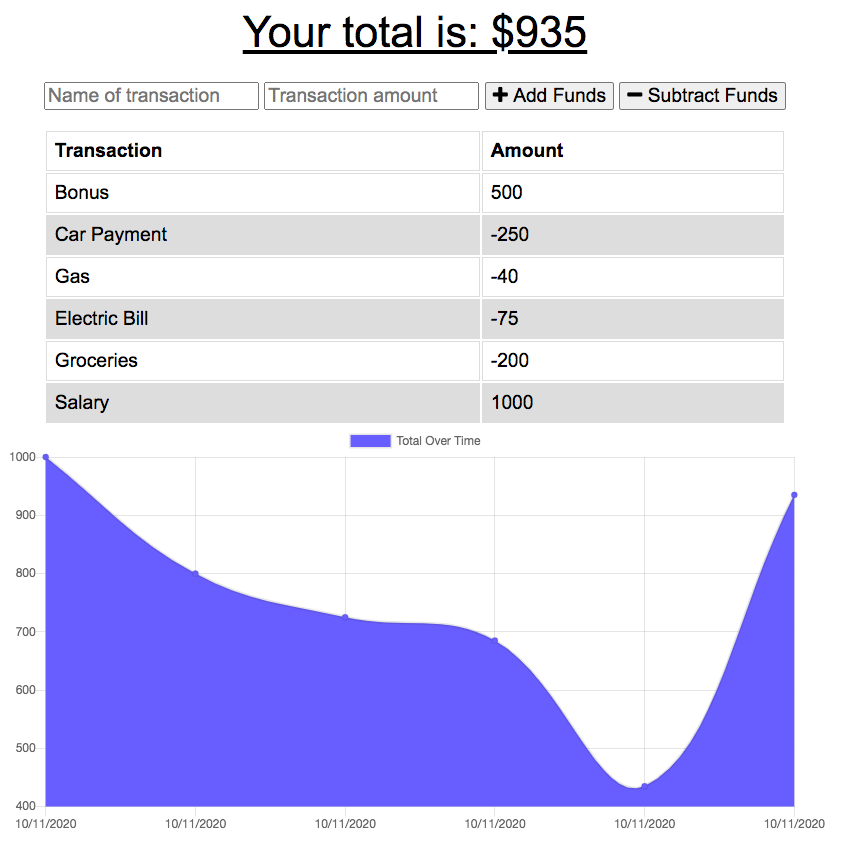

# Budget Tracker
* A RESTful API backend for a social network

## Description
* This is a Budget Tracker Progressive Web Application (PWA) that records and tracks positive or negative transactions and keeps a running total.  The front end is a simple single page application that keeps a running HTML table of the transactions and uses Chart.js to create a graph of the currently available funds.

* The backend is a Node.js server hosted on Heroku utilizing a MongoDB Atlas NoSQL database to creat a RESTful API.  The API stores and recalls the transactions via GET and POST requests.

* This is a Progressive Web Application (PWA) that utilizes IndexDB as a proxy server when offline, and the Service Worker (along with its manifest.json) to cache files for offline use.  When the application reconnects to the network it will push any offline changes that had been made and stored in the IndexDB and sync them with the database.

* Users can also click the "+" sign in the URL to save the PWA to their desktop or home screen.

## Links
* [GitHub Repo Link](https://github.com/taylornyquist/social-network-api)
* [Link to Deployed Application](https://glacial-forest-71855.herokuapp.com/)

## Screen Shot



## Table of Contents

* [Usage](#usage)
* [Installation](#installation)
* [Run](#run)
* [Technology](#technology)
* [Questions](#questions)
* [Contribution](#contribution)

## Usage
Visit the Heroku [link](https://glacial-forest-71855.herokuapp.com/) to use the deployed application.

To run application locally, go to GitHub to clone the repo on your machine.

## Installation
To install necessary dependencies, run the following command:
```
npm init
```
```
npm install
```
This should install the following dependencies into package.json:

```
  "dependencies": {
    "compression": "^1.7.4",
    "express": "^4.17.1",
    "mongoose": "^5.5.15",
    "morgan": "^1.9.1"
  }
```

## Run
To run the application as a local host, run:

```
npm start
```

## Technology
This application used the following technology:

* HTML
* CSS
* JavaScript
* Node.js
* Express.js
* MongoDB
* Mongoose JS
* Chart.js
* Morgan
* Compression

## Questions
If you have any questions about the repo, open an issue or contact me directly at tnyquist@gmail.com.  You can find more of my work at [taylornyquist](https://github.com/taylornyquist).


## Contribution
* Taylor Nyquist